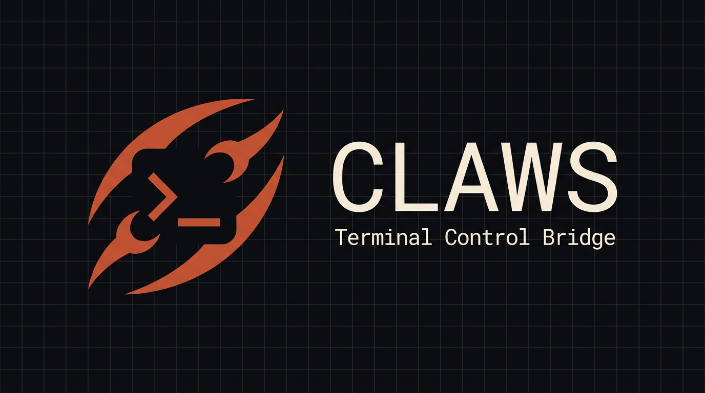
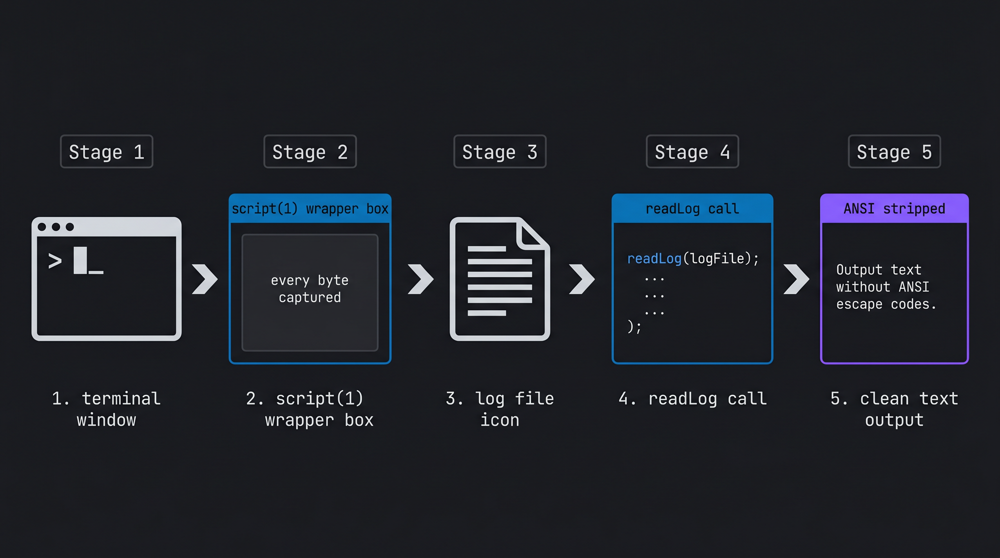

# Claws — Programmable Terminal Bridge

Turn every VS Code terminal into a programmable endpoint your AI agent can drive.

---

## What it does

Claws is a VS Code extension that runs a local socket server inside your editor. Any external process — Claude Code, an orchestration script, a CI runner — connects over Unix socket and gets full programmatic control of every terminal: list, create, send text, execute commands with captured output, read pty logs, and close. No plugins in the terminal, no shell integration required.

The key feature is **wrapped terminals**: Claws uses VS Code's native Pseudoterminal API (backed by `node-pty`) to capture every pty byte into an in-memory ring buffer. That buffer is readable via the `claws_read_log` MCP tool with ANSI escapes stripped — giving AI agents clean, structured visibility into Claude Code sessions, build logs, vim sessions, or any TUI. Combine this with 39 MCP tools across 6 categories (terminal control, pub/sub, tasks, lifecycle, waves, RPC/schemas) and you get a full AI orchestration substrate inside your editor.

---

## Demo


---

## Quick Install

1. **Install the extension** from the VS Code Marketplace (search `Claws: Programmable Terminal Bridge`)
2. **Run the project installer** from your project root:
   ```bash
   bash <(curl -fsSL https://raw.githubusercontent.com/neunaha/claws/main/scripts/install.sh)
   ```
   This writes `.mcp.json`, `.claws-bin/mcp_server.js`, and `.claude/commands/` into your project. Re-run in each project you want Claws in.
3. **Reload VS Code** (`Cmd+Shift+P` → `Developer: Reload Window`) then restart Claude Code from the project root so it picks up `.mcp.json` and loads the 39 Claws tools. If tools don't appear, run `/claws-fix`.

---

## The 8 Commands

| Command | What it does |
|---|---|
| `/claws` | Live dashboard — terminal count, socket state, version |
| `/claws-do <task>` | Universal verb — classifies any task and runs the right tool |
| `/claws-status` | Show all active terminals and their lifecycle state |
| `/claws-cleanup` | Close all worker terminals; leave user-created ones untouched |
| `/claws-help` | Full reference for every command and MCP tool |
| `/claws-fix` | Diagnose and auto-repair a broken installation in one command |
| `/claws-report` | Bundle logs and diagnostics into a shareable file for bug reports |
| `/claws-update` | Pull latest version and rebuild in place |

---

## Key Capabilities

### `claws_done()` — one-tool completion


Workers call `claws_done()` as their final act. The tool reads `CLAWS_TERMINAL_ID` from the worker's environment (injected at spawn), publishes `system.worker.completed` to the Claws event bus, and closes the terminal — all in one atomic call, zero arguments. No marker scanning, no manual polling.

### Worker fleet — parallel Claude workers with auto-monitoring


`claws_fleet(workers=[…])` spawns N wrapped terminals in parallel, boots Claude Code in each with full permissions, delivers missions via bracketed paste, and returns `terminal_ids` + `correlation_ids` immediately. The orchestrator polls completion with `claws_workers_wait` or arms per-worker Monitors via `stream-events.js --wait <uuid>`. `claws_dispatch_subworker` enables Wave Army patterns with LEAD + sub-worker coordination.

### Wrapped pty capture — every byte logged, ANSI-stripped



Wrapped terminals use VS Code's `Pseudoterminal` API with `node-pty` — no `script(1)`, no rendering corruption. Every byte flows through the extension's `onDidWrite` event into a ring buffer. `claws_read_log` returns clean text with ANSI escapes stripped, enabling AI agents to read back TUI sessions they can't otherwise see.

### Safety gate — warn before sending into TUIs


Before sending text, Claws checks whether the foreground process is a shell or a TUI (Claude Code, vim, htop). If it's a TUI, the send proceeds with a warning — the caller decides. Pass `strict: true` to hard-block. This is what makes it safe to automate terminals that also have human users.

### Self-diagnosis — `/claws-fix` repairs the install chain


`/claws-fix` runs a structured diagnostic sequence: checks the socket, verifies MCP registration in `.mcp.json`, probes `node-pty` load path, validates the hook chain, and repairs any broken layer it finds. **Health Check** (`cmd+alt+c h`) gives an instant introspection snapshot. The status bar item shows live socket state at a glance.

---

## Settings Reference

| Setting | Default | Description |
|---|---|---|
| `claws.socketPath` | `.claws/claws.sock` | Relative path from workspace root for the Unix socket |
| `claws.logDirectory` | `.claws/terminals` | Relative path for wrapped terminal pty logs |
| `claws.defaultWrapped` | `false` | Create all new terminals as wrapped by default |
| `claws.maxOutputBytes` | `262144` | Max bytes buffered per command event (256 KB) |
| `claws.maxHistory` | `500` | Max command events in the ring buffer |
| `claws.maxCaptureBytes` | `1048576` | Max per-terminal output in the in-memory capture buffer (1 MB) |
| `claws.execTimeoutMs` | `180000` | Default exec command timeout in milliseconds (180 s) |
| `claws.pollLimit` | `100` | Max history events returned by a single `poll` request |
| `claws.heartbeatIntervalMs` | `60000` | Interval between `system.heartbeat` events (0 = disable) |
| `claws.strictEventValidation` | `false` | Reject publish requests that fail schema validation |
| `claws.auth.enabled` | `false` | Require HMAC-SHA256 token on hello requests |
| `claws.auth.tokenPath` | `.claws/auth.token` | Path to the shared secret file for token validation |
| `claws.webSocket.enabled` | `false` | [Planned] Enable WebSocket server for cross-device access |
| `claws.webSocket.port` | `5678` | [Planned] TCP port for the WebSocket server |

---

## Keyboard Shortcuts

| Shortcut | Action |
|---|---|
| `cmd+alt+c h` (Mac) / `ctrl+alt+c h` (Win/Linux) | Health Check — instant introspection snapshot |
| `cmd+alt+c l` / `ctrl+alt+c l` | Show Log — open the Claws Output channel |
| `cmd+alt+c s` / `ctrl+alt+c s` | Show Status — markdown runtime block |

---

## What's New in v0.7

- **`claws_done()` is now the primary completion signal** — one zero-arg MCP call publishes `system.worker.completed`, closes the terminal, and frees the orchestrator. No more marker scanning.
- **Wave Army** — `claws_fleet` and `claws_dispatch_subworker` enable parallel Claude worker fleets with LEAD orchestration, heartbeat protocol, and per-role phase events.
- **Non-blocking workers by default** — mission-mode `claws_worker` returns immediately with `terminal_id` + `correlation_id`; blocking is opt-in. The MCP stdio transport no longer hangs on long missions.
- **Behavioral injection enforcement** — a 5-layer chain (global `CLAUDE.md` → project `CLAUDE.md` block → SessionStart hook → PreToolUse hook → Stop hook) ensures workers follow the terminal hygiene contract even across cold boots.
- **LH-9 TTL watchdog** — workers that exceed their TTL or violate the heartbeat contract are automatically terminated with a `wave_violation` event; the orchestrator is never left waiting on a dead worker.
- **8-command set** — 27 commands consolidated to 8. `/claws-do` routes into exec, worker, fleet, and wave buckets automatically.
- **`stream-events.js --wait <uuid>`** — native Node.js completion waiter replaces fragile awk/grep pipelines; per-worker Monitors self-exit on the first matching `system.worker.completed` event.

---

## Windows / WSL

The core extension and MCP server work on Windows and WSL. Wrapped terminal pty capture uses VS Code's native `Pseudoterminal` API (backed by `node-pty`) rather than `script(1)`, so there are no BSD vs GNU compatibility differences. The `install.sh` project setup script requires a bash environment — run it from WSL or Git Bash on Windows. On WSL, the Unix socket path (`.claws/claws.sock`) resolves inside the WSL filesystem; cross-boundary socket access is not supported.

---

## Links

- [GitHub](https://github.com/neunaha/claws) — source, issues, contributing
- [Documentation](https://github.com/neunaha/claws/tree/main/docs) — protocol spec, guide, feature reference
- [Issues](https://github.com/neunaha/claws/issues) — bug reports and feature requests
